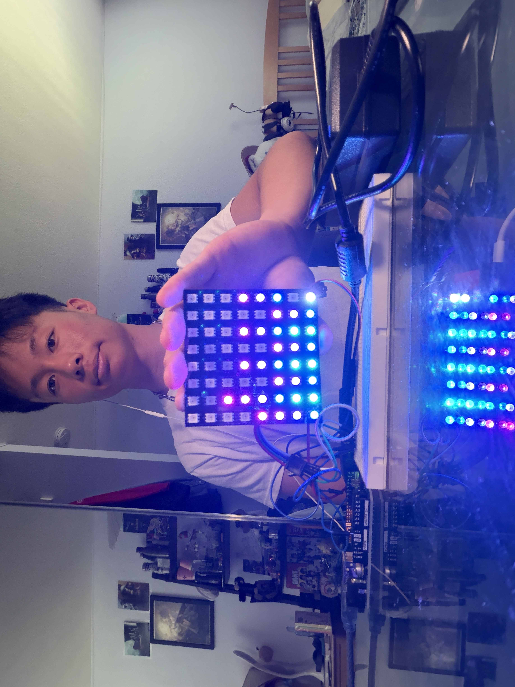

 # Audio Visualizer
My project takes in sound and frequency to display an animation on a matrix, which creates a very unique, animation-like pattern that fluctuates with the music you listen to. There are two versions of this project, one where it can be hooked up directly to a device and display the sound coming directly from the device, and the other model is one where the sound is taken in from the environment and displays whatever it hears.

You should comment out all portions of your portfolio that you have not completed yet, as well as any instructions:
```HTML 
<!--- This is an HTML comment in Markdown -->
<!--- Anything between these symbols will not render on the published site -->
```

| **Engineer** | **School** | **Area of Interest** | **Grade** |
|:--:|:--:|:--:|:--:|
| Dylan T | Evergreen Valley High School | Mechanical Engineering | Incoming Senior

**Replace the BlueStamp logo below with an image of yourself and your completed project. Follow the guide [here](https://tomcam.github.io/least-github-pages/adding-images-github-pages-site.html) if you need help.**


  
# Final Milestone

**Don't forget to replace the text below with the embedding for your milestone video. Go to Youtube, click Share -> Embed, and copy and paste the code to replace what's below.**

<iframe width="560" height="315" src="https://youtube.com/shorts/ibIaXyWrMWU?feature=share" title="YouTube video player" frameborder="0" allow="accelerometer; autoplay; clipboard-write; encrypted-media; gyroscope; picture-in-picture; web-share" allowfullscreen></iframe>

For your final milestone, explain the outcome of your project. Key details to include are:
- Since the first milestone, I have made three major changes to my project. I removed the sound sensor so that the matrix displays patterns generated directly by a device rather than by the environment. I also updated the matrix display; the new one I am using is RGB and can display a wider range of colors and more complex patterns. Lastly, I now have a separate power adapter that connects directly to the matrix to prevent the Arduino from short-circuiting.
- During my time at Bluestamp Engineering, my biggest challenge was troubleshooting my project, as the first time I attempted to create the base and modified project, something would go wrong, and a random pattern would be shown on the display. Figuring out what was wrong was extremely difficult as I had no clue where to start, having only the knowledge provided to me by the tutorial. On that note, however, my biggest triumphs are when I find the issue, whether it be a hardware or software issue, as from there I know my project will work.
- Throughout the project, I learned the basics of wiring and labels that are commonly used in electronics, such as V5, which stands for power, and GND, meaning ground. I also learned a lot about debugging and the importance of libraries in code, and how they can affect what happens within the code.
- In the future, I hope to learn more about electrical systems and be able to understand how they operate without relying on a guide or manual. I would also like to learn more about coding an Arduino, as there is far more that is possible with it that I haven't explored yet.

# First Milestone

**Don't forget to replace the text below with the embedding for your milestone video. Go to Youtube, click Share -> Embed, and copy and paste the code to replace what's below.**

<iframe width="560" height="315" src="https://www.youtube.com/embed/EOAn__2-9FA?si=JDM3DLJOGKv7l_py" title="YouTube video player" frameborder="0" allow="accelerometer; autoplay; clipboard-write; encrypted-media; gyroscope; picture-in-picture; web-share" allowfullscreen></iframe>

For your first milestone, describe what your project is and how you plan to build it. You can include:
- Currently, the project uses an ELEGOO UNO R3 Arduino, a breadboard, several jumper wires, a data-capable USB cable, an 8x32 MAX7219 Dot Matrix, and an LM393 Sound Detection Sensor Module.
- I've completed my base project; the pieces are all put together, and the code makes it run as intended.
- Challenges: My main challenge was optimizing the sensitivity: when it was too low, I wouldn't get the animation effect I wanted on the display; however, if it were too high, visuals would be displayed on the matrix even if no sound was being played. So to fix this, I added a sound floor, which essentially meant that if a sound registered as too quiet, the program would treat it as silence.
- What I learned from this is the importance of looking at a problem from a different angle, as I originally planned on brute-forcing the code to find the optimal sensitivity, which likely would've taken way longer than the solution I used.
- Next, I plan on replacing the current display with a new one that is larger and has a wider selection of colors.
  On top of that, I intend to eliminate the need for a sound sensor so I can just plug the Arduino into any device I wish and have it display the animation based on the sound coming directly from the device.

# Schematics 
Here's where you'll put images of your schematics. [Tinkercad](https://www.tinkercad.com/blog/official-guide-to-tinkercad-circuits) and [Fritzing](https://fritzing.org/learning/) are both great resoruces to create professional schematic diagrams, though BSE recommends Tinkercad becuase it can be done easily and for free in the browser. 

# Code (Base Project)
Here's where you'll put your code. The syntax below places it into a block of code. Follow the guide [here]([url](https://www.markdownguide.org/extended-syntax/)) to learn how to customize it to your project needs. 

```c++

#include <SPI.h>
#include <MD_MAX72xx.h>
#include <arduinoFFT.h>

// Dot Matrix Display
#define HARDWARE_TYPE MD_MAX72XX::FC16_HW   
#define MAX_DEVICES   4
#define CLK_PIN       13
#define DATA_PIN      11
#define CS_PIN        10

MD_MAX72XX mx = MD_MAX72XX(HARDWARE_TYPE, CS_PIN, MAX_DEVICES);

// Sound Sensor
const int MIC_PIN = A0;

// FFT Settings
const uint16_t SAMPLES            = 64;      // must be a power of 2; also 2x the number of display columns
const double   SAMPLING_FREQUENCY = 9000.0;  // Hz, approx. max for a stock Uno's analogRead() - fine for a visual effect

double vReal[SAMPLES];
double vImag[SAMPLES];
ArduinoFFT<double> FFT = ArduinoFFT<double>(vReal, vImag, SAMPLES, SAMPLING_FREQUENCY);

//It's a fixed value you tune by hand instead. Raise it if the bars are
//always maxed out; lower it if they barely move.
double SENSITIVITY = 3.3;

// Noise Gate: bars below this magnitude are treated as silence
const long NOISE_FLOOR = 8;

const byte spectralHeight[] = {
  0b00000000, 0b10000000, 0b11000000, 0b11100000,
  0b11110000, 0b11111000, 0b11111100, 0b11111110, 0b11111111
};

void setup() {
  Serial.begin(115200);
  mx.begin();
  mx.control(MD_MAX72XX::INTENSITY, 8); // brightness 0 (dim) - 15 (bright)

  // Display self-test: full-brightness flash, unrelated to audio.
  mx.clear();
  for (uint16_t c = 0; c < mx.getColumnCount(); c++) mx.setColumn(c, 0xFF);
  delay(500);
  mx.clear();
}

void loop() {
  sampleAudio();

  FFT.windowing(FFTWindow::Hamming, FFTDirection::Forward);
  FFT.compute(FFTDirection::Forward);
  FFT.complexToMagnitude();

  if (DEBUG) printDebug();

  drawSpectrum();
}

void sampleAudio() {
  // Sampled back-to-back as fast as analogRead() allows. Exact timing
  // isn't critical for a visual effect, just reasonably consistent.
  int raw[SAMPLES];
  long total = 0;

  for (uint16_t i = 0; i < SAMPLES; i++) {
    raw[i] = analogRead(MIC_PIN);
    total += raw[i];
  }

  double mean = total / (double)SAMPLES; // remove DC offset so silence sits near 0
  for (uint16_t i = 0; i < SAMPLES; i++) {
    vReal[i] = (raw[i] - mean) / SENSITIVITY;
    vImag[i] = 0.0;
  }
}

void drawSpectrum() {
  mx.control(MD_MAX72XX::UPDATE, MD_MAX72XX::OFF);
  for (uint16_t i = 0; i < 32; i++) {
    long magnitude = (long)constrain(vReal[i], 0.0, 80.0);

    if (magnitude < NOISE_FLOOR) {
      magnitude = 0; // treat anything below the floor as silence
    }

    int      rowsLit = map(magnitude, 0, 80, 0, 8);
    uint16_t column  = 31 - i; // low frequencies on the right; drop the "31 -" to mirror it
    mx.setColumn(column, spectralHeight[rowsLit]);
  }
  mx.control(MD_MAX72XX::UPDATE, MD_MAX72XX::ON);
}

void printDebug() {
  static unsigned long lastPrint = 0;
  if (millis() - lastPrint < 300) return;
  lastPrint = millis();

  double peak = 0;
  for (uint16_t i = 1; i < 32; i++) peak = max(peak, vReal[i]);
  Serial.println(peak);
}
```
# Code (Modified Project in Processing)

```c++
import ddf.minim.*;
import ddf.minim.analysis.*;
import processing.serial.*;

// Adjustable settings
float SENSITIVITY = 15.0;
float SMOOTHING   = 0.75;
final float MIN_FREQ = 40;
final float MAX_FREQ = 18000;
// ────────────────────────────────────────────────────────

final int COLS = 8;
final int ROWS = 8;

Minim minim;
AudioInput audioIn;
FFT fft;
Serial arduinoPort;
float[] smoothed = new float[COLS];

void setup() {
  size(640, 400);
  background(0);

  minim   = new Minim(this);
  audioIn = minim.getLineIn(Minim.STEREO, 1024);
  fft     = new FFT(audioIn.bufferSize(), audioIn.sampleRate());

  println("=== Available Serial Ports ===");
  printArray(Serial.list());

  for (String port : Serial.list()) {
    if (port.contains("usbmodem") || port.contains("usbserial") || port.contains("COM")) {
      arduinoPort = new Serial(this, port, 115200);
      println("✅ Arduino connected on: " + port);
      break;
    }
  }

  if (arduinoPort == null) {
    println("⚠️  Arduino not found! Check your USB cable.");
  }
}

void draw() {
  background(0);
  fft.forward(audioIn.mix);

  for (int i = 0; i < COLS; i++) {
    float lo  = MIN_FREQ * pow(MAX_FREQ / MIN_FREQ, (float) i / COLS);
    float hi  = MIN_FREQ * pow(MAX_FREQ / MIN_FREQ, (float)(i + 1) / COLS);

    float avg = fft.calcAvg(lo, hi) / SENSITIVITY;

    smoothed[i] = smoothed[i] * SMOOTHING + avg * (1 - SMOOTHING);
    smoothed[i] = constrain(smoothed[i], 0, 1);

    float barH = smoothed[i] * height;
    float barW = width / COLS;

    fill(smoothed[i] * 255, (1 - smoothed[i]) * 255, 200);
    noStroke();
    rect(i * barW, height - barH, barW - 4, barH);

    fill(150);
    textSize(11);
    textAlign(CENTER);
    text(nf(lo, 0, 0) + "Hz", i * barW + barW / 2, height - 5);
  }

  if (arduinoPort != null) {
    byte[] data = new byte[COLS];
    for (int i = 0; i < COLS; i++) {
      data[i] = (byte) constrain((int)(smoothed[i] * ROWS), 0, ROWS);
    }
    arduinoPort.write(data);
  }
}

void stop() {
  if (audioIn != null) audioIn.close();
  minim.stop();
  super.stop();
}
```
# Code (Modified Project Arduino IDE)
```c++
#include <FastLED.h>

#define LED_PIN 6
#define WIDTH 8
#define HEIGHT 8
#define NUM_LEDS 64

CRGB leds[NUM_LEDS];

byte levels[WIDTH];

int XY(int x, int y)
{
  if (y % 2 == 0)
    return y * WIDTH + x;
  else
    return y * WIDTH + (WIDTH - 1 - x);
}

void setup()
{
  Serial.begin(115200);

  FastLED.addLeds<WS2812B, LED_PIN, GRB>(leds, NUM_LEDS);

  FastLED.setBrightness(150);
}

void loop()
{
  if (Serial.available() >= WIDTH)
  {
    for (int i = 0; i < WIDTH; i++)
    {
      levels[i] = Serial.read();
      if (levels[i] > 8)
        levels[i] = 8;
    }

    fill_solid(leds, NUM_LEDS, CRGB::Black);

    for (int x = 0; x < WIDTH; x++)
    {
      for (int y = 0; y < levels[x]; y++)
      {
        float t = (float)x / 3.5;  // fade completes halfway across the matrix

if (t > 1)
  t = 1;

uint8_t hue = map(t * 100, 0, 100,
                  128,   // teal
                  220);  // pink

        leds[XY(x, y)] = CHSV(hue, 255, 255);
      }
    }

    FastLED.show();
  }
}
```
# Bill of Materials
Here's where you'll list the parts in your project. To add more rows, just copy and paste the example rows below.
Don't forget to place the link to buy each component inside the quotation marks in the corresponding row after href =. Follow the guide [here]([url](https://www.markdownguide.org/extended-syntax/)) to learn how to customize this to your project needs. 

| **Part** | **Note** | **Price** | **Link** |
|:--:|:--:|:--:|:--:|
| ELEGOO UNO R3  Starter Kit| The kit has most of the components of the project, including the Arduino, jumper wires, and breadboard | $42.99 | <a href="https://us.elegoo.com/products/elegoo-uno-r3-super-starter-kit"> Link </a> |
| MAX7219 Dot Matrix Modules | This matrix module is used to display the audio pattern so that the user can visually see it (This was the original display before modifications were made) | $8.99 | <a href="https://www.amazon.com/HiLetgo-MAX7219-Arduino-Microcontroller-Display/dp/B07FFV537V/ref=pd_lpo_d_sccl_1/130-6636251-1976042?pd_rd_w=MyvLL&content-id=amzn1.sym.4c8c52db-06f8-4e42-8e56-912796f2ea6c&pf_rd_p=4c8c52db-06f8-4e42-8e56-912796f2ea6c&pf_rd_r=GHV1AQEJBTEPJW0QYPEY&pd_rd_wg=vSckP&pd_rd_r=9d7dd0d7-ed34-4fb0-aabc-0b135484cd26&pd_rd_i=B07FFV537V&psc=1"> Link </a> |
| 8X8 64 Pixels LED Matrix | This is the matrix that has a wider range of colors and the brightness changes are more noticeable, which is why I replaced the previous matrix with this one | $12.99 | <a href="https://www.amazon.com/BTF-LIGHTING-Upgraded-Individually-Addressable-Controller/dp/B0FD99FXXL?th=1"> Link </a> |
| 120W Power Adapter | To supply another power source to the matrix module to make sure the Arduino wasn't the only power source to prevent issues | $30.99 | <a href="https://www.amazon.com/BTF-LIGHTING-DC12V-Aluminum-Supply-Modules/dp/B01D8FLXJU?th=1"> Link </a> |

# Other Resources/Examples
One of the best parts about Github is that you can view how other people set up their own work. Here are some past BSE portfolios that are awesome examples. You can view how they set up their portfolio, and you can view their index.md files to understand how they implemented different portfolio components.
- [Example 1](https://trashytuber.github.io/YimingJiaBlueStamp/)
- [Example 2](https://sviatil0.github.io/Sviatoslav_BSE/)
- [Example 3](https://arneshkumar.github.io/arneshbluestamp/)

To watch the BSE tutorial on how to create a portfolio, click here.
